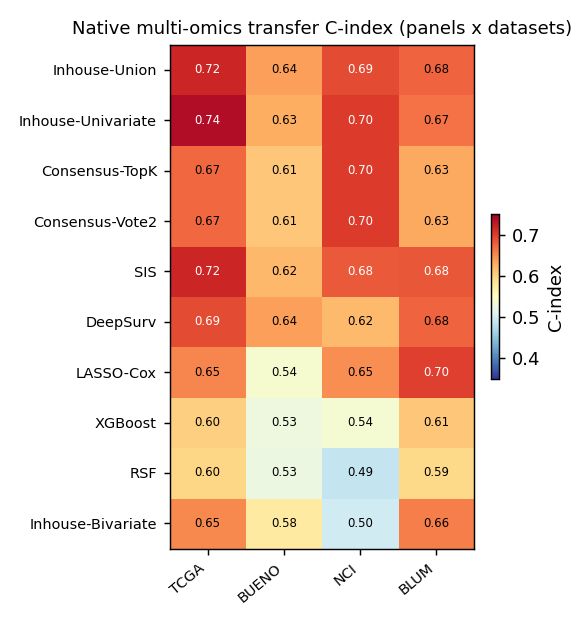
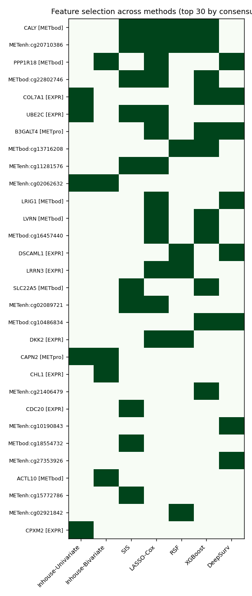

# Multi-omics prognostic feature selection for mesothelioma

**We developed a new, reliability-first feature-selection workflow**, **benchmarked it against
commonly used methods**, and **selected reproducible prognostic biomarker panels for malignant
pleural mesothelioma (MPM)** to take forward for validation.

Trained on **MESOMICS multi-omics** (120 patients × ~25,000 features), validated by cross-cohort
survival transfer, biological pathway analysis, single-cell expression, and literature. Self-contained
(isolated `.venv` on `/mnt/data`, fixed seed 42).

Full results with figures: **[`results/REPORT.md`](results/REPORT.md)** · method details:
**[`DESIGN.md`](DESIGN.md)**.

## The workflow, as a reusable tool — `omicsfs`

The core method is packaged as a small, cohort-agnostic library ([`omicsfs/`](omicsfs/)):

```python
from omicsfs import OmicsSurvivalSelector
sel = OmicsSurvivalSelector().fit(X, durations=t, events=e)   # X: samples × features
sel.selected_features_        # reproducible prognostic panel
```

Repeated event-stratified split screening (univariate χ² + epistasis hubs) → bootstrap stability
LASSO-Cox → union of features that reproduce across resamples. See [`omicsfs/README.md`](omicsfs/README.md)
and run the demo: `python -m omicsfs.example`.


## Benchmark

Every method starts from the same 800-feature pre-screen pool and is scored by one common evaluation
(internal 5-fold CV + cross-cohort transfer with 95% bootstrap CIs). Only **faithful, verified**
survival methods are used as comparators:

| method | notes |
|---|---|
| **In-house workflow** | reliability-first (omicsfs) — the method under test |
| SIS | marginal Cox screening (sure independence screening) |
| LASSO-Cox | plain L1-penalized Cox |
| RSF | Random Survival Forest, OOB-tuned |
| XGBoost | gradient-boosted Cox, CV-tuned |
| DeepSurv | **native `pycox`** (run in an isolated env) |

The in-house panel generalizes best on cross-cohort transfer (though CIs overlap at n=120).







## Run

```bash
bash run_all.sh          # full pipeline → results/
```

## Pipeline stages (`src/`)

| stage | script | does |
|---|---|---|
| 1 | `01_build_data.py` | MESOMICS multi-omics matrix + survival |
| 1b | `02_build_validation.py` | transferable TCGA methylation/alteration layers |
| 2 | `03_featsel_inhouse.py` | in-house reliability-first selection (the `omicsfs` method) |
| 3 | `04_featsel_thirdparty.py` | SIS, LASSO-Cox, tuned RSF/XGBoost, native pycox DeepSurv |
| 3b | `05_consensus.py` | cross-method consensus panels |
| 4 | `06_evaluate.py` | cross-cohort transfer C-index + bootstrap CIs |
| 6 | `08_biology.py` | KEGG pathway enrichment / cancer-network check |
| 7 | `09_singlecell.py` | pleura scRNA cell-type expression |
| 8 | `10_literature.py` | curated prognostic-evidence check |
| 9 | `11_target_dossier.py` | drug-discovery target cards (direction, druggability, immuno-oncology) |
| 5 | `07_report.py` | figures + `REPORT.md` |

## Cohorts (all pleural MPM)

| cohort | role | layers used in transfer |
|---|---|---|
| MESOMICS | **train** | all (EXPR, CNV, LOH, MET×3, ALT, SV) |
| TCGA-MESO (Hmeljak 2018) | validation | EXPR + methylation + alterations (multi-omics) |
| Bueno 2016 / NCI 2023 / Blum 2019 | validation | EXPR (gene-expression surrogate) |

## Data availability

Patient-level MESOMICS / TCGA matrices are **not** included in this repository (data-use terms). The
code expects them under `data/processed/`; obtain the source cohorts under their original terms to
reproduce. Environments (`.venv`, `external/.venv_pycox`, R libs) are rebuildable and gitignored;
see `requirements.txt` and `requirements-pycox.txt`.
