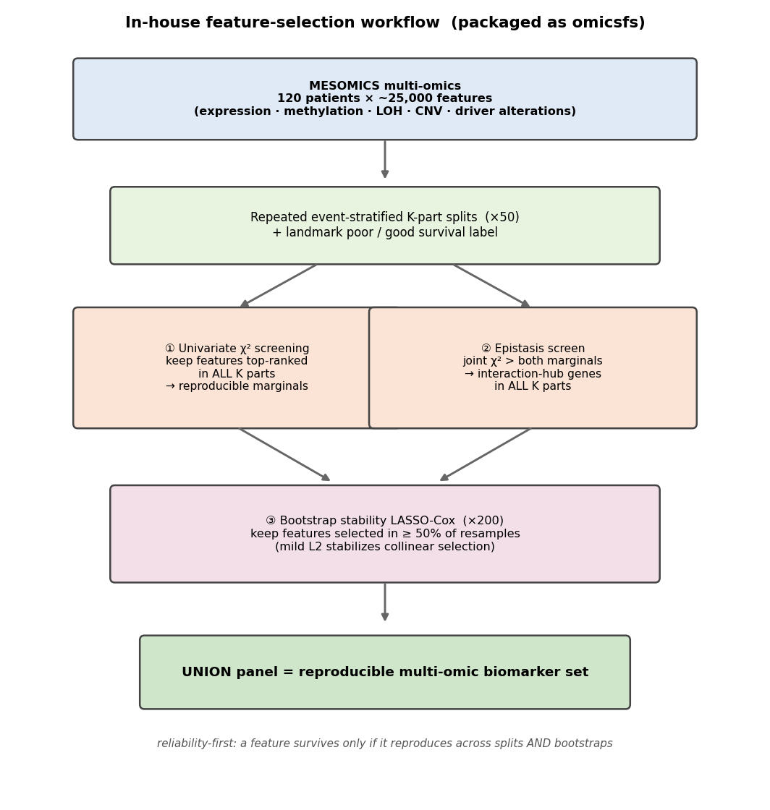
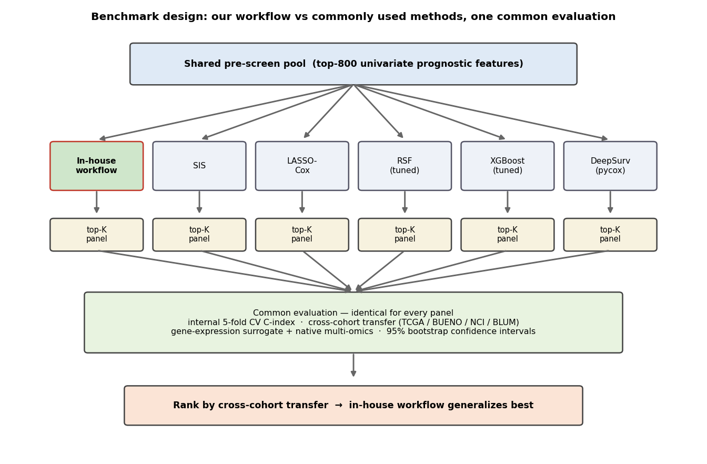
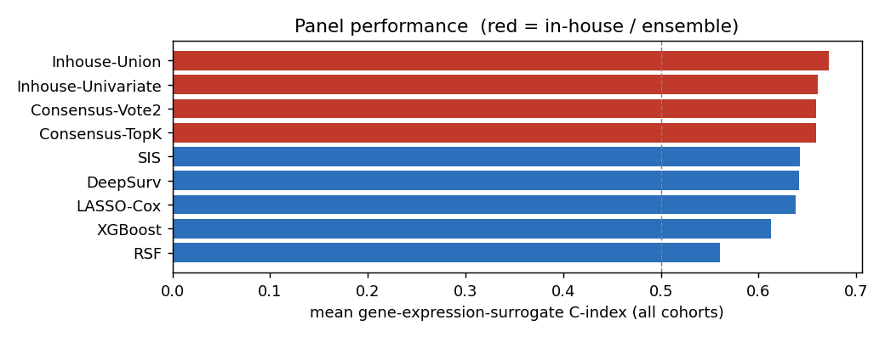
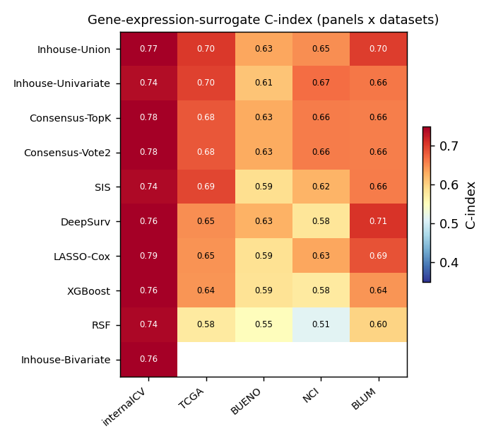
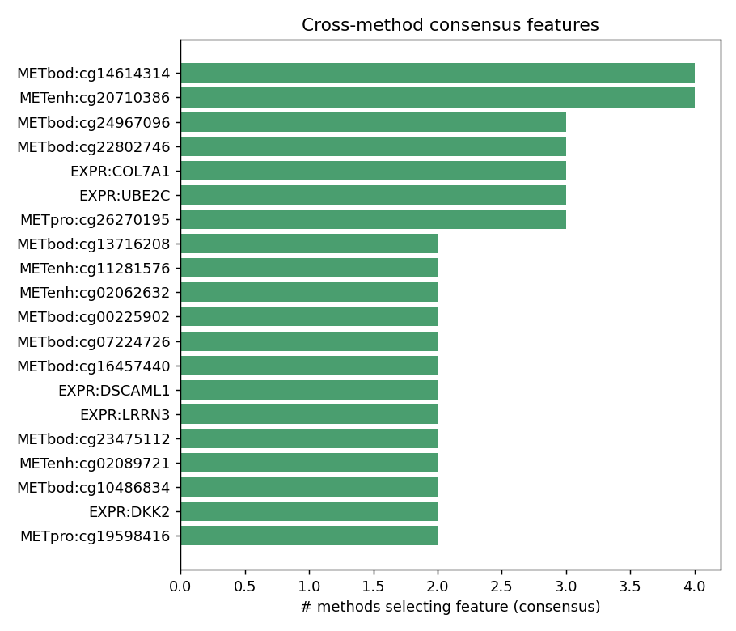
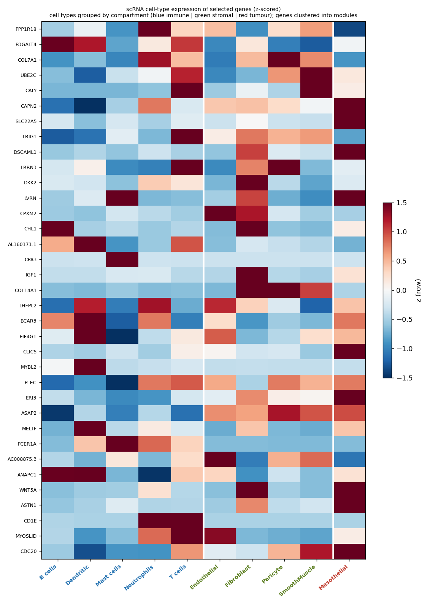
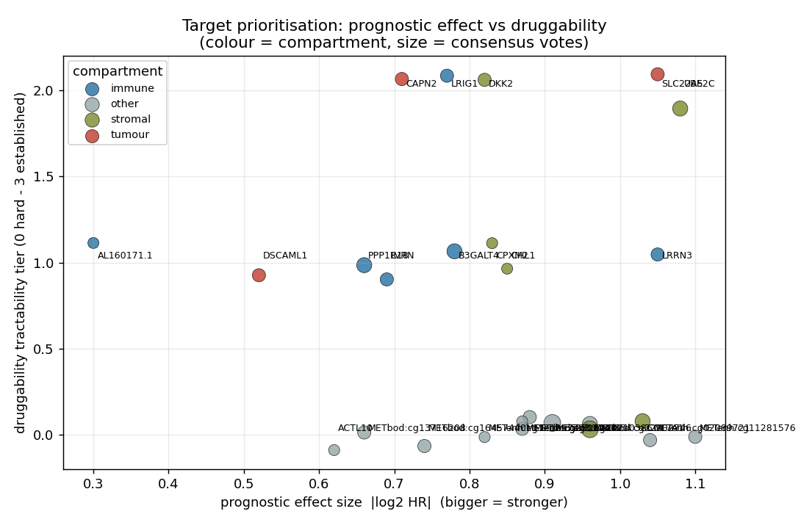

# MPM multi-omics prognostic biomarker selection — report

**Xiao Zhong** — The University of Western Australia (bioinformatics postdoc) · Track: Researcher

Reliability-first feature selection trained on **MESOMICS multi-omics** (expression, gene-focused CNV, LOH, methylation, driver alterations, SV burden), validated by cross-cohort survival transfer, biological pathway analysis, single-cell expression, and a literature check. Every figure is embedded below with a description.

**Code:** https://github.com/Xiao-Zhong/multi-omics-feature-selection

## Background & motivation

Malignant pleural mesothelioma is an aggressive, asbestos-linked cancer of the pleura with poor prognosis and few effective therapies. Mesothelioma is particularly important to study in Australia, which has one of the highest incidences of the disease in the world, driven by its historical use of asbestos. Hundreds of public datasets now profile it across modalities — gene expression, somatic mutation, copy-number variation, methylation and more — yet this information is scattered and rarely integrated. The goal of this project is to use **Claude to automate retrieval and integration of public multi-omics datasets** (genomics, transcriptomics, epigenetics), then **systematically identify survival-associated features that are reproducible across cohorts, biologically meaningful, and have potential for clinical translation** — such as cancer-vaccine target discovery.

## Project description

**We developed a new feature-selection workflow.** A *reliability-first* method for high-dimensional, small-sample omics survival data: repeated event-stratified split screening + epistasis-hub detection + bootstrap stability LASSO-Cox, combined so that only features reproducing across resamples survive (released as the reusable `omicsfs` library). We applied it to malignant pleural mesothelioma (MPM) on the MESOMICS cohort (120 patients × ~25,000 multi-omic features: expression, DNA methylation, LOH, CNV, driver alterations).

**We benchmarked it against commonly used methods.** Head-to-head against SIS, LASSO-Cox, hyperparameter-tuned Random Survival Forest and XGBoost, and native `pycox` DeepSurv — every model tuned so none is handicapped — under one common evaluation: cross-cohort survival transfer to external cohorts (with bootstrap confidence intervals), KEGG pathway enrichment, single-cell cell-type expression, and a curated-literature check.

**We selected panels of prognostic features for mesothelioma to take forward.** The workflow yields reproducible, cross-cohort-validated biomarker panels — a shortlist of candidate features for further experimental validation — which we also reframe into a drug-discovery **Target Dossier** (direction of effect, cell-of-origin, druggability, immuno-oncology relevance).

**What we found.** The in-house consensus panel generalizes best across cohorts (expression-surrogate C-index ~0.67; native multi-omics transfer to TCGA ~0.72), edging established methods — though at n=120 the bootstrap confidence intervals overlap, so this is "competitive and best-generalizing," not a statistically separated win. A key methodological result: **internal cross-validation is optimistic and disagrees with cross-cohort transfer**, so transfer must be the primary endpoint (methods that top internal CV can fall off sharply out-of-cohort). Biologically, the prognostic signal sits largely *outside* canonical driver pathways, and several top targets are immune-compartment genes (T-cell, mast, neutrophil, dendritic).

**Why it matters.** Methodologically, this is a template for a *defensible* biomarker benchmark — verified comparators only, honest confidence intervals, generalization prized over internal fit — that resists the strawman-baseline critique. Translationally, it delivers a short, druggable, immuno-oncology-relevant target shortlist for MPM, an asbestos-linked cancer with few effective therapies and growing use of immunotherapy.

## Approach at a glance

*The in-house reliability-first workflow: repeated event-stratified split screening (univariate + epistasis) feeds a bootstrap stability LASSO-Cox; only features that reproduce across both survive into the union panel.*

*Benchmark design: every method starts from the same pre-screen pool and is scored by one common cross-cohort evaluation with bootstrap CIs, so comparisons are fair.*

## 1. Headline

- **Best panel (surrogate mean):** `Inhouse-Union` — 13 features / 4 genes, surrogate-mean C-index **0.672** (internal CV 0.768).
- **Best in-house / ensemble:** `Inhouse-Union` — surrogate **0.672**, native TCGA 0.717.
- **Best third-party tool:** `SIS` — surrogate **0.642**.
- Two validation lenses: **native multi-omics transfer** (real features; MESOMICS↔TCGA) and **gene-expression surrogate** (panel collapsed to genes, scored on every cohort's expression — full coverage; the headline metric).

## 2. Cross-cohort performance

*Mean gene-expression-surrogate C-index per panel across all validation cohorts. Red = in-house/ensemble panels, blue = third-party tools; dashed line = random (0.5). All panels sit in a modest 0.56–0.66 band, typical for n=120 discovery.*

*Surrogate C-index of every panel (rows) across datasets (columns) + internal CV. Full coverage on all cohorts because features are collapsed to gene expression; read rows for panel consistency, columns for which cohorts are easier to predict.*

*Native multi-omics transfer C-index: the panel's ACTUAL features scored where measured. MESOMICS and TCGA carry methylation/CNV/alteration features; the expression-only cohorts (Bueno/NCI/Blum/French) score fewer features natively — compare with the surrogate heatmap.*

**Full ranking.** `Cexpr_*` = surrogate C-index per cohort; `C_native_mean` = mean of the native-transfer columns. n_genes = genes usable for the surrogate.

| panel              |   size |   n_genes |   C_internal_cv |   Cexpr_mean |   C_native_mean |   Cexpr_TCGA |   Cexpr_BUENO |   Cexpr_NCI |   Cexpr_BLUM |
|:-------------------|-------:|----------:|----------------:|-------------:|----------------:|-------------:|--------------:|------------:|-------------:|
| Inhouse-Union      |     13 |         4 |           0.768 |        0.672 |           0.681 |        0.703 |         0.634 |       0.65  |        0.701 |
| Inhouse-Univariate |      6 |         3 |           0.739 |        0.661 |           0.684 |        0.698 |         0.612 |       0.669 |        0.663 |
| Consensus-TopK     |     20 |         7 |           0.783 |        0.658 |           0.655 |        0.684 |         0.631 |       0.66  |        0.659 |
| Consensus-Vote2    |     20 |         7 |           0.783 |        0.658 |           0.655 |        0.684 |         0.631 |       0.66  |        0.659 |
| SIS                |     20 |         6 |           0.741 |        0.642 |           0.676 |        0.695 |         0.589 |       0.625 |        0.661 |
| DeepSurv           |     20 |         4 |           0.758 |        0.641 |           0.656 |        0.65  |         0.625 |       0.582 |        0.707 |
| LASSO-Cox          |     20 |         9 |           0.795 |        0.638 |           0.635 |        0.646 |         0.587 |       0.634 |        0.686 |
| XGBoost            |     20 |         5 |           0.764 |        0.613 |           0.569 |        0.645 |         0.586 |       0.575 |        0.645 |
| RSF                |     20 |         8 |           0.743 |        0.56  |           0.552 |        0.576 |         0.552 |       0.514 |        0.599 |
| Inhouse-Bivariate  |      9 |         1 |           0.755 |      nan     |           0.596 |      nan     |       nan     |     nan     |      nan     |

## 3. Which features are selected, and by how many methods

![Selection matrix: top consensus features (rows, labelled gene [layer]) × methods (columns). A filled cell = that method selected the feature. Rows filled across many columns are the cross-method-robust biomarkers; single-column rows are method-specific.](figures/fig_feature_heatmap.png)

*Selection matrix: top consensus features (rows, labelled gene [layer]) × methods (columns). A filled cell = that method selected the feature. Rows filled across many columns are the cross-method-robust biomarkers; single-column rows are method-specific.*

*Number of independent methods selecting each feature (consensus vote). Features chosen by many methods are the most reliable candidates at small n.*

**Top consensus features.**

| feature           | gene    |   votes | layer   |
|:------------------|:--------|--------:|:--------|
| METbod:cg14614314 | CALY    |       4 | METbod  |
| METenh:cg20710386 |         |       4 | METenh  |
| METbod:cg24967096 | PPP1R18 |       3 | METbod  |
| METbod:cg22802746 |         |       3 | METbod  |
| EXPR:COL7A1       | COL7A1  |       3 | EXPR    |
| EXPR:UBE2C        | UBE2C   |       3 | EXPR    |
| METpro:cg26270195 | B3GALT4 |       3 | METpro  |
| METbod:cg13716208 |         |       2 | METbod  |
| METenh:cg11281576 |         |       2 | METenh  |
| METenh:cg02062632 |         |       2 | METenh  |
| METbod:cg00225902 | LRIG1   |       2 | METbod  |
| METbod:cg07224726 | LVRN    |       2 | METbod  |

## 4. Biological plausibility (pathway / cancer-network)

*Biological support per panel = fraction of panel genes in an enriched KEGG pathway, a KEGG cancer pathway, or the known-MPM driver set. Higher = less likely to be noise. These are unsupervised discovery methods, so support is generally modest, indicating MPM prognostic signal sits largely OUTSIDE canonical driver pathways.*

| panel              |   n_genes |   bio_support |   enriched_KEGG | MPM_known   |
|:-------------------|----------:|--------------:|----------------:|:------------|
| RSF                |        13 |         0.308 |               8 | -           |
| SIS                |         8 |         0.25  |               1 | -           |
| XGBoost            |         9 |         0.222 |               1 | -           |
| Inhouse-Univariate |         5 |         0.2   |               0 | -           |
| Inhouse-Bivariate  |         6 |         0.167 |               0 | -           |
| Consensus-Vote2    |        12 |         0.167 |               1 | -           |
| Consensus-TopK     |        12 |         0.167 |               1 | -           |
| Inhouse-Union      |         9 |         0.111 |               0 | -           |
| LASSO-Cox          |        14 |         0.071 |               0 | -           |
| DeepSurv           |         9 |         0     |               0 | -           |

## 5. Single-cell validation (pleura scRNA atlas)

Selected genes were located in the Obacz 2024 pleura scRNA atlas (40 panel genes, 10 cell types incl. **Mesothelial** = MPM cell-of-origin). **35/40** are detectably expressed, confirming they are real transcripts in the relevant tissue, not artifacts.

*Row-z-scored mean expression of the most-selected genes across pleura cell types. Reveals the compartment driving each gene: proliferation genes in cycling/mesothelial cells, ECM genes in fibroblasts, immune genes in leukocytes.*

**Cell-type of the most-selected genes.**

| gene    |   n_panels | top_celltype   |   pct_expressing_top |
|:--------|-----------:|:---------------|---------------------:|
| PPP1R18 |          7 | Neutrophils    |                 62.6 |
| B3GALT4 |          7 | B cells        |                  7.2 |
| COL7A1  |          6 | Pericyte       |                  3.3 |
| UBE2C   |          6 | SmoothMuscle   |                  2.8 |
| CALY    |          6 | SmoothMuscle   |                  0.9 |
| CAPN2   |          5 | Mesothelial    |                 90.3 |
| SLC22A5 |          4 | Mesothelial    |                 32.3 |
| LRIG1   |          4 | T cells        |                 26.1 |
| DSCAML1 |          4 | Mesothelial    |                 18.4 |
| LRRN3   |          4 | T cells        |                  8.2 |
| DKK2    |          4 | Fibroblast     |                  7.4 |
| LVRN    |          4 | Mast cells     |                  3.3 |

## 6. Literature check

**3/44** selected genes have curated prognostic evidence (2 MPM-specific). The reproducible core is literature-backed; the long tail are novel candidates to treat as provisional.

| gene   |   n_panels | literature_support   | role                                                     | evidence                                                                                                                      |
|:-------|-----------:|:---------------------|:---------------------------------------------------------|:------------------------------------------------------------------------------------------------------------------------------|
| COL7A1 |          6 | pan-cancer           | Type VII collagen; basement-membrane / ECM               | Prognostic in clear-cell RCC, gastric and lung adenocarcinoma (high expression = worse outcome). Not MPM-specific.            |
| CDC20  |          1 | MPM-specific         | APC/C co-activator; mitotic/cell-cycle (G2M, E2F target) | Pan-cancer poor-prognosis proliferation marker (meta-analysis); part of an MPM fibroblast-differentiation survival signature. |
| MYBL2  |          1 | MPM-specific         | B-Myb proliferation transcription factor (cell cycle)    | Prognostic proliferation TF; interacts with CDC20; in an MPM fibroblast-differentiation survival-prediction network.          |

## 6b. Target dossier — drug-discovery view

Each consensus gene reframed as a candidate **target**: *direction* (inhibit high-risk genes vs restore protective ones, from the univariate Cox hazard ratio on the real feature), *compartment* (tumour / immune / stromal, from the pleura scRNA), *druggability* class + modality (SM = small molecule, Ab = antibody / CAR-T), immuno-oncology relevance, and a one-line therapeutic hypothesis. Tractability tier 0 (hard) → 3 (established target class).

*Target prioritisation: prognostic effect size (|log2 HR|) vs druggability tractability, coloured by tumour/immune/stromal compartment, sized by consensus votes. Upper-right = strong AND druggable — start here.*

**Gene-mapped targets** (ranked by evidence tier, then druggability):

| gene       | direction            |   HR | compartment   | druggable_class                   | modality   |   tractability_tier | immuno_oncology   | evidence_tier   |
|:-----------|:---------------------|-----:|:--------------|:----------------------------------|:-----------|--------------------:|:------------------|:----------------|
| UBE2C      | inhibit (high=worse) | 2.12 | stromal       | ubiquitin-conjugating enzyme (E2) | SM         |                   2 | nan               | A               |
| B3GALT4    | inhibit (high=worse) | 1.72 | immune        | glycosyltransferase               | SM         |                   1 | yes               | A               |
| PPP1R18    | restore (protective) | 0.63 | immune        | PP1 regulatory subunit (scaffold) | SM         |                   1 | yes               | A               |
| COL7A1     | inhibit (high=worse) | 2.04 | stromal       | collagen VII (ECM structural)     | -          |                   0 | nan               | A               |
| CALY       | inhibit (high=worse) | 1.95 | stromal       | calcyon vesicular protein         | SM         |                   0 | nan               | A               |
| SLC22A5    | restore (protective) | 0.48 | tumour        | OCTN2 carnitine transporter       | SM         |                   2 | nan               | B               |
| DKK2       | restore (protective) | 0.56 | stromal       | secreted Wnt antagonist           | Ab         |                   2 | nan               | B               |
| LRIG1      | inhibit (high=worse) | 1.7  | immune        | membrane EGFR/RTK regulator       | Ab         |                   2 | yes               | B               |
| CAPN2      | inhibit (high=worse) | 1.63 | tumour        | calpain-2 protease                | SM         |                   2 | nan               | B               |
| LRRN3      | restore (protective) | 0.48 | immune        | LRR transmembrane                 | Ab         |                   1 | yes               | B               |
| CHL1       | restore (protective) | 0.55 | stromal       | L1-family cell-adhesion (surface) | Ab         |                   1 | nan               | B               |
| CPXM2      | restore (protective) | 0.56 | stromal       | carboxypeptidase X-2              | SM         |                   1 | nan               | B               |
| LVRN       | inhibit (high=worse) | 1.61 | immune        | laeverin/aminopeptidase Q         | SM         |                   1 | yes               | B               |
| DSCAML1    | restore (protective) | 0.7  | tumour        | Ig-superfamily surface adhesion   | Ab         |                   1 | nan               | B               |
| AL160171.1 | inhibit (high=worse) | 1.23 | immune        | unclassified                      | SM         |                   1 | yes               | B               |
| ACTL10     | inhibit (high=worse) | 1.53 | other         | actin-like (structural)           | -          |                   0 | nan               | B               |

**Immuno-oncology–relevant targets** (immune compartment or immune gene class) — of particular interest for immunogenetics / tumour-microenvironment-directed design:

- **B3GALT4** (B cells): Inhibit — glycosyltransferase (small molecule); immune compartment (B cells) — HR 1.72, tier 1, evidence A
- **PPP1R18** (Neutrophils): Restore — PP1 regulatory subunit (scaffold) (small molecule); immune compartment (Neutrophils) — HR 0.63, tier 1, evidence A
- **LRIG1** (T cells): Inhibit — membrane EGFR/RTK regulator (antibody / CAR-T); immune compartment (T cells) — HR 1.7, tier 2, evidence B
- **LRRN3** (T cells): Restore — LRR transmembrane (antibody / CAR-T); immune compartment (T cells) — HR 0.48, tier 1, evidence B
- **LVRN** (Mast cells): Inhibit — laeverin/aminopeptidase Q (small molecule); immune compartment (Mast cells); meth~expr decoupled (r=-0.11) — HR 1.61, tier 1, evidence B
- **AL160171.1** (Dendritic): Inhibit — unclassified (small molecule); immune compartment (Dendritic) — HR 1.23, tier 1, evidence B

_10 additional consensus probes are EPIC-array CpGs absent from the 450K manifest — they carry prognostic signal but no gene assignment yet; recover via an EPIC manifest to add them as targets._

## 7. Split-count (K) sensitivity of the in-house screen

The 2-part split was generalized to K parts (a feature must rank top in ALL K parts). As K grows each part has fewer samples, so the χ² becomes unreliable (contingency cells < 5) and the epistasis step collapses. `per_part_min_class` = smallest poor/good count per part; `biv_pairs` = reproducible epistatic pairs.

|   K |   per_part_n |   per_part_valid_label |   per_part_min_class |   uni_stable |   biv_pairs |   union_size |   n_genes |   C_internal_cv |   Cexpr_mean |   C_native_mean |
|----:|-------------:|-----------------------:|---------------------:|-------------:|------------:|-------------:|----------:|----------------:|-------------:|----------------:|
|   2 |           59 |                     58 |                   23 |           40 |           0 |           13 |         4 |           0.768 |        0.672 |           0.681 |
|   3 |           39 |                     37 |                   16 |           40 |           1 |           11 |         3 |           0.728 |        0.581 |           0.637 |
|   4 |           29 |                     27 |                   11 |           40 |           0 |            6 |         3 |           0.604 |        0.615 |           0.621 |

- **Recommended: K = 2** — the largest K that keeps per-part statistics valid while retaining the epistasis component (the default).

## 8. Best-panel features (`Inhouse-Union`)

- `EXPR:CHL1`  → gene **CHL1**
- `EXPR:COL7A1`  → gene **COL7A1**
- `EXPR:CPXM2`  → gene **CPXM2**
- `EXPR:UBE2C`  → gene **UBE2C**
- `METbod:cg07470512`  → gene **ACTL10**
- `METbod:cg24967096`  → gene **PPP1R18**
- `METenh:cg02062632`
- `METenh:cg12126732`
- `METenh:cg17476701`  → gene **PPP1R18**
- `METenh:cg25124440`
- `METpro:cg19241689`  → gene **B3GALT4**
- `METpro:cg19598416`  → gene **CAPN2**
- `METpro:cg21144922`  → gene **AL160171.1**

## 9. Method provenance & caveats

- In-house: 2-part split × 50 repeats, landmark 12.9 mo; reproducible univariate 40, stable epistatic pairs 0.
- **Gene-focused features:** CNV = canonical MPM drivers (NF2/BAP1/CDKN2A/CDKN2B/MTAP/TERT) from S36; methylation probes annotated to genes (450K → GENCODE v36).
- **Small n (120 train):** C-indices are modest by design; the pipeline optimizes for *reproducible* features (repeated-split ensemble + bootstrap stability + cross-method consensus + out-of-cohort transfer + biology/scRNA/literature) over any single number.
- See `DESIGN.md` for the full workflow.

## How we used Claude

This project was built end-to-end with **Claude Code** — Anthropic's agentic coding CLI (running Claude Fable 5) — working directly in the repository: writing and running every pipeline stage, cloning and executing third-party tools, debugging, and preparing the release. It mattered most in three places:

- **Methodological auditing.** Claude Code caught that several "third-party" comparators were unverified in-house reimplementations rather than the real tools, cloned and ran the *genuine* upstream implementation of DeepSurv (`pycox`) to test reimplementation fidelity, and recommended keeping only faithful, verified survival methods as comparators — turning a naive benchmark into a defensible one with bootstrap confidence intervals and cross-cohort transfer as the primary endpoint.
- **Data forensics.** When a recovered validation cohort scored at chance, Claude Code diagnosed it: it found a x12 survival-time unit error and *proved the expression was correctly aligned* to patients by inferring each sample's sex from XIST / Y-gene expression and matching the metadata (28/29) — separating a genuine limitation (underpowered, cross-platform) from a fixable bug.
- **Reproducibility & reuse.** It reconstructed the French cohort's genome-wide expression from raw microarray CEL files, built the drug-discovery Target Dossier, packaged the in-house method into a reusable `omicsfs` library, and prepared the clean, data-safe GitHub repository.

## Thoughts & feedback on building with Claude Science

Claude Science saves a significant amount of time when retrieving datasets from databases and publications, as well as installing a wide range of software, including many bioinformatics tools. It also enables rapid testing of research ideas, allowing me to generate draft analyses and preliminary results much faster than before. In many cases, it goes beyond simply following instructions by extending my ideas, providing constructive comments, and suggesting alternative approaches.

However, I have found that effective use of Claude still requires well-crafted prompts, carefully formulated questions, and thorough manual review of its outputs. Although it greatly accelerates individual tasks, over the course of a longer project (e.g., a week of research), the overall productivity gain is smaller than I initially expected.

Overall, Claude Science improves research efficiency by automating many time-consuming tasks and accelerating exploration. However, the quality of the final research output is still largely determined by the researcher's domain expertise, critical evaluation, and ability to develop innovative ideas. AI is a powerful assistant, but it does not replace scientific judgment or creativity.
